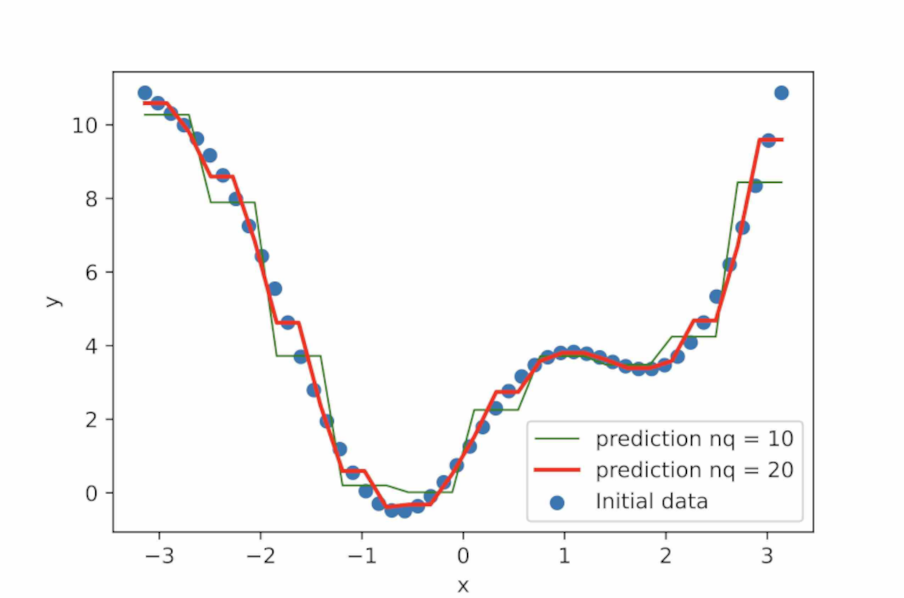

**Minimalistic 1D regressor** (fitting) model **using the Quantile-based discretization function** from **Pandas**. The code is only 35 lines long and performs well.
The code illustrates approximately the main idea of a Decision Tree Regressor where the initial set is divided in multiple sub-sets. 

```
import numpy as np
import matplotlib.pyplot as plt
from quantileRegressor import quantileRegressor

# train data
x = np.linspace(-np.pi, np.pi, 50)
y = x**2 + 2*np.sin(2*x) + 1

# test data
x_test = np.linspace(-np.pi, np.pi, 30)

# fit and predict
model1 = quantileRegressor(10)
model2 = quantileRegressor(20)
model1.fit(x, y)
model2.fit(x, y)
pred_y1 = model1.predict(x_test)
pred_y2 = model2.predict(x_test)

plt.figure(figsize=(5.9, 3.9))
plt.scatter(x, y, label='Initial data')
plt.plot(x_test, pred_y1, 'g', lw = 1, label = 'prediction nq = 10')
plt.plot(x_test, pred_y2, 'r', lw = 2, label = 'prediction nq = 20')
plt.legend(loc="lower right")
plt.xlabel("x")
plt.ylabel("y")
plt.show()
```



